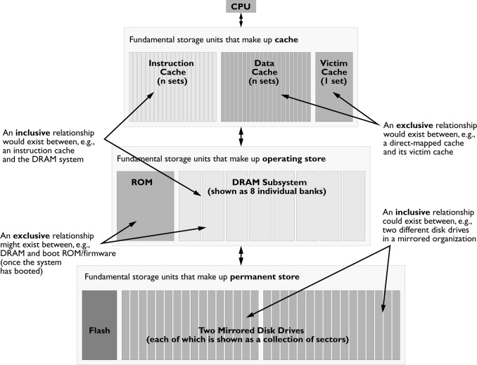

### Cache, Memory Hierarchy

#### 存储层次结构 (memory hierarchy)

**Q：为什么需要memory hierarchy？**

A：processor-memory performance gap，DRAM带宽的增长速度慢于处理器需要访问DRAM的次数

- CPU 60%/year, DRAM 9%/year
- multi-core processors需要的带宽需求更大


**Q：memory的一般组织形式与工作原理**

- 典型的memory hierarchy
  - CPU与DRAM间增加cache memory (SRAM)，提高访存速度的同时，降低存储系统成本


- 工作原理：temporal locality + spatial locality
  - 最近被访问到的可能会被连续访问
  - 被访问到的元素地址周围的数据很可能会在后续被访问


#### cache基础知识

基于spatial locality原理，数据以块(block)为基本单元存取数据，CPU在读取数据时，先判断数据是否在最近一级的cache中，若在cache中则称之为cache hit；若不存在，则出现了cache miss，需要把数据从较低层级的memory搬到高层级。cache的大小称之为cahe size，代表cache可以缓存最大数据的大小。我们将cache平均分成相等的很多块，每一个块大小称之为cache line，其大小是cache line size。现在的硬件设计中，一般cache line的大小是4-128 Bytes。

cache miss出现的原因包括(3C's)：

- 强制性失效 compulsory 
  - 第一次访问只能从下一级load，冷启动
- 容量失效 capacity
  -  容量太小，所需块不能全部调入cache，某些被替换的块又被重新访问
- 冲突失效 conflit/collision 
  - 多个块映射到同一组中，组中某个块被别的块替换后被访问，区别于容量失效，此时cache中可能有空闲位置

在多处理器系统中，还存在为保证各处理器缓存之间的数据一致性而进行数据清空/无效化所造成的失效。这类失效称为*一致失效*（**C**oherency miss）

**Q：映像规则：一个block data搬入cache时，放在cache哪个位置**

*Note: CPU读数据时，假设是从主存读数据，其地址大小要远大于cache大小，因此cache只能保存主存中的少量数据。*

- 全相连 fully associate：block可以放在cache任意位置
- 直接映像 directed mapped：block根据地址哈希(e.g., 块cache地址=块索引地址 mod cache中数据块数目)放在cache固定位置
- 组相连映像 (N-way) set associate：将M块cache分成N组，每组M/N个block，组间直接映像，组内全相连

**Q：cache hit的判断**

现代计算机一般用2/4-way组相连或者直接映像，下图给出一个2-way组相连的例子。


更形象的例子如下，参考[知乎博客](https://zhuanlan.zhihu.com/p/102293437)，假设64 Bytes cache size，cache line size是8 Bytes，2-way组相连，每路包含4行cache line。cache line大小是8 Bytes，所以我们可以利用地址低3 bits（如上图地址蓝色部分）用来寻址8 bytes中某一字节，我们称这部分bit组合为offset。同理，4行cache line，为了覆盖所有行。我们需要2  bits（如上图地址黄色部分）查找某一行，这部分地址部分称之为index。如果两个不同的地址，其地址的bit3-bit5如果完全一样的话，那么这两个地址经过硬件散列之后都会找到同一个cache line。所以，当我们找到cache line之后，只代表我们访问的地址对应的数据可能存在这个cache  line中，但是也有可能是其他地址对应的数据。所以，我们又引入tag array区域，每个tag中保存的是整个地址位宽去除index和offset使用的bit剩余部分（如上图地址绿色部分），以及标识当前cacheline是否包含有效数据的valid位，tag、index和offset三者组合就可以唯一确定一个地址了。对于2-way组相连，每一个cache line对应2个tag，当我们根据地址中index位找到cache line后，取出当前cache line对应的所有tag，并和地址中的tag进行比较，如果存在一个tag相等，即为cache hit。


引申：cache控制器根据地址查找判断是否命中，这里的地址究竟是虚拟地址(virtual address，VA)还是物理地址(physical address，PA)？CPU发出对某个地址的数据访问，这个地址其实是虚拟地址，虚拟地址经过MMU转换成物理地址，最终从这个物理地址读取数据。因此cache的硬件设计既可以采用虚拟地址也可以采用物理地址甚至是取两者地址部分组合作为查找cache的依据。

A：参考 https://zhuanlan.zhihu.com/p/107096130

**Q：何时分配cache?**

- 读分配：当CPU读数据时，发生cache缺失，这种情况下都会分配一个cache line缓存从主存读取的数据。默认情况下，cache都支持读分配
- 写分配：当支持写分配时，若CPU写数据发生cache缺失，首先从主存中加载数据到cache line中（相当于先做个读分配动作），然后更新cache line中的数据

**Q：cache更新的方式? (cache replacement policy)**

Cache里存的数据是Memory中的**常用**数据一个拷贝，Cache比较小，不可以缓存Memory中的所有数据。当Cache存满后，再需要存入一个新的条目时，就需要把一个旧的条目从缓存中拿掉，这个过程称为evict，一个被evict的条目称为victim。缓存管理单元通过一定的算法决定哪些数据有资格留在Cache里，哪些数据需要从Cache里移出去。这个策略称为**替换策略（replacement policy)**，常见替换策略：

- Random
- Least-Recently Used (LRU)
  - LRU cache state must be updated on every access
  - True implementation only feasible for small sets (2-way)
  - Pseudo-LRU binary tree often used for 4-8 way
- First-In, First-Out (FIFO) a.k.a. Round-Robin
  - Used in highly associative caches
  - Not-Most-Recently Used (NMRU)
- FIFO with exception for most-recently used line or lines  

**Q：当对cache进行写操作时，是否同步更新主存的数据？(cache update policy)**

- write through：更新，保证cache与主存内容的一致性
- write back：先只更新cache中的数据，通过置cache line中1-bit dirty bit (D）标识。当主存中的数据在cache line被替换或者显示的clean操作时再更新。该策略下cache和主存的数据可能不一致

在write back策略中，数据仅写到Cache中，此时Cache中的数据与Memory中的数据不一致，Cache中的数据就变成了脏数据(dirty)。如果其他部件（DMA， 另一个核）访问这段数据的时候，就需要通过**Cache一致性协议**(Cache coherency protocol)保证取到的是最新的数据。

当CPU对主存写数据的时候发生写失效时，也有两种更新策略：

- write allocate/fetch on write: 先把缩写单元所在块调入cache，再进行写入
- no-write allocate: 数据直接写入下一级存储器，也叫write around

因程序对存储器读操作频率大于写操作(26% vs. 9%)，所以应优先优化cache读操作，但也不能忽视。

#### cache性能评估与优化

cache性能使用平均访存时间衡量：

```
平均访存时间(AMAT)=命中时间(hit time)+失效率(miss rate)*失效开销(miss penalty)
```

根据上述公式，得到cache性能优化的基本方法：

1. 降低失效率

- 增加cache块大小: 
  - Reduces compulsory misses; Increases capacity and conflict misses, increases miss penalty
- 增大cache容量: 
  - Increases hit time, increases power consumption
- 提高相连度: 
  - Reduces conflict misses; Increases hit time, increases power consumption

2. 减少失效开销

- 多级cache
  - inclusive cache vs. exclusive cache，当存在多级cache发生cache miss，是否保证L1 cache的块总在L2 cache中，即是否保证一致性，当是时为inclusive cache
- 使读失效优先于写失效

3. 缩短命中时间

- 避免再索引缓存期间进行地址转换

不同的方法均通过实际程序实测的思路，分析优化前后性能，并在不同指标间做trade-off。

**cache高级优化方法：**


几个方法的补充说明：

- multibanked caches: Organize cache as independent banks to support simultaneous access
  - Interleave banks according to block address


- prefetching: 可以预取指令或数据

不同优化方法总结：


一个更为实际的memory herarchy例子：



- 指令-数据分离缓存：流水线会在instruction fetch和memory access两个阶段上访问内存，如不增加缓存端口将会造成结构性冒险（Structural hazard）。一种办法是使用两片一级缓存，分别服务于指令抓取和内存访问两个阶段。这样，前一个一级缓存称为指令缓存，后一个则为数据缓存
- Victim Cache: 在直接映射或者较小的k-way全相连旁边额外加的一小块全相联cache。当一个数据块被逐出缓存时，并不直接丢弃，而是暂先进入Victim Cache缓存，出发点是根据统计刚刚被替换的数据常被访问

#### 存储器技术和优化

##### SRAM (略) 6T

##### DRAM 1T 

- 基本原理与局限性
  - 访问需要经过三个阶段：Precharge，row access, column access 
  - 需要定期刷新
- 优化思路
  - Fast Page Model operation: Multiple accesses to same row  
  - Synchronous DRAM: burst mode
  - Double data rate (DDR) : Wider interfaces + Multiple banks on each DRAM device
- 新的技术：HBM等

#### 虚拟存储

- 页式管理与段式管理
- TLB，translation lookaside buffer 用于缓存存虚拟地址和其映射的物理地址
  - https://zhuanlan.zhihu.com/p/108425561


**参考材料：**

- 计算机体系结构-量化研究方法, 6th

- https://en.wikipedia.org/wiki/CPU_cache

- https://www.zhihu.com/column/cpu-cache

