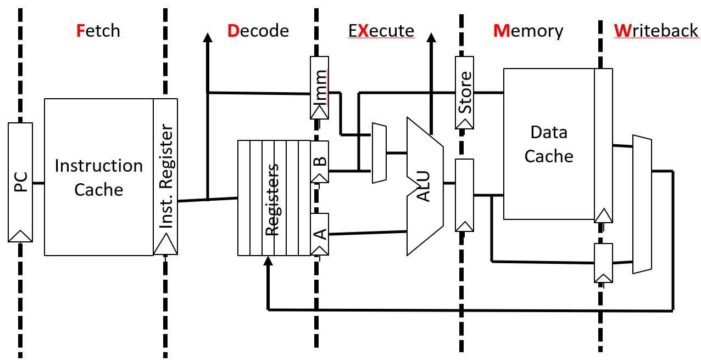
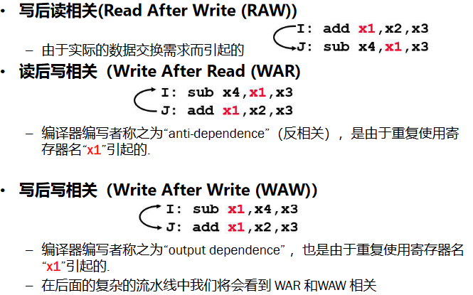
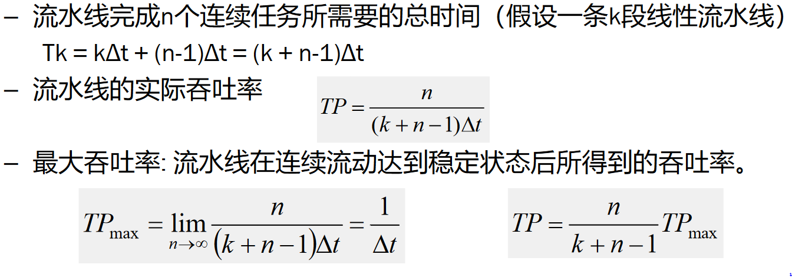
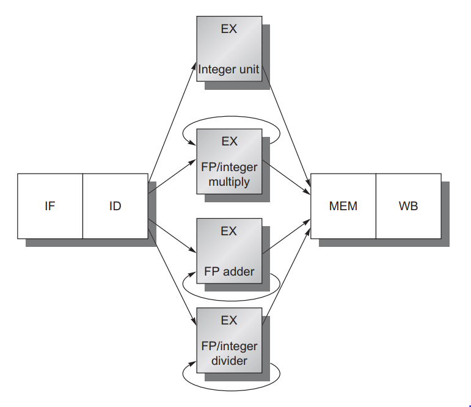
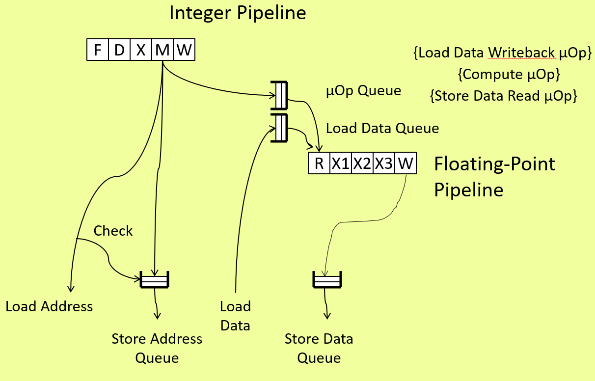
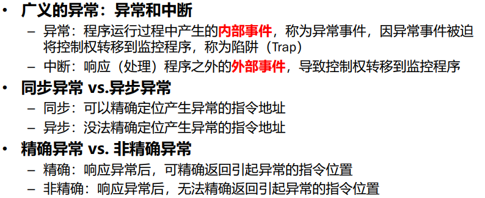
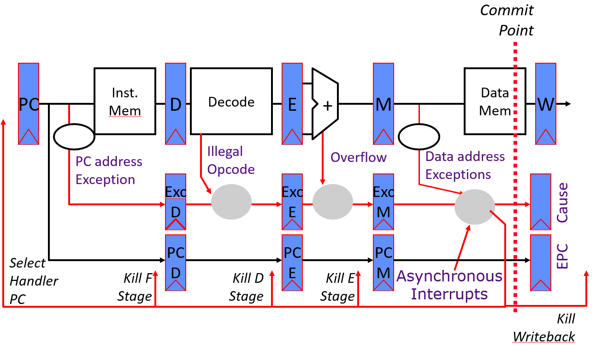

### 流水线

#### 经典流水线

流水线通过使用不同的资源让多个任务重叠（并发/并行）执行提高整个系统的吞吐率，但不能缩短单个任务的执行时间，其潜在的加速比＝流水线的级数。经典的5-stage RISC流水线如下，每段延迟为一个cycle：

- IF: 取值阶段
  - 选择地址：下一条指令地址、转移地址
- ID: 译码阶段
  - 确定控制信号 并从寄存器文件中读取寄存器值
- EX: 执行
  - Load 、Store：计算有效地址
  - Branch：计算转移地址并确定转移方向
- MEM: 存储器访问（仅Load和Store)
- WB: 结果写回

由于存在相关(hazards)问题，即流水线的执行可能会导致对资源的访问冲突，或破坏对资源的访问顺序，会导致流水线停顿。处理相关的一般方法是插入bubble，导致CPI>1 (单发射理想CPI=1）。

#### 流水线竞争(相关)

##### 结构竞争

流水线中一条指令可能需要另一条指令使用的资源，消解思路包括：

– 方法1：通过将新指令延迟到前一条指令执行完（释放资源后）执行
– 方法2：增加新的资源，e.g., 如果两条指令同时需要操作存储器，可以通过增加到两个存储器操作端口来避免结构冲突

另外，有些微架构在设计时可以保证没有结构相关，相关思路：

- 分离的instruction cache和data cache；寄存器的双沿触发

##### 数据竞争

某条指令依赖先前指令产生的结果(数据)值，包括：

三种常见的消减机制：

- 联锁机制（Interlock）
  - 在issue阶段保持当前相关指令，等待相关解除
- 设置旁路定向路径（Bypass or Forwarding)
  - 只要结果可用，通过旁路尽快传递数据
- 投机（Speculate）
  - 猜测一个值继续，如果猜测错了再更正，常用场景包括：分支预测、堆栈指针更新、存储器地址消除歧义（Memory address disambiguation）

- 软件层面通过指令调度的优化避免

##### 控制竞争

分支指令的跳转判断依赖先前未执行完的指令，本质在于如何确定下一条指令地址(next PC)。常见解决办法：

- 等待一直到stall结束，可通过修改数据通路减少stall
- **分支预测 (branch prediction)**
- 延迟槽技术：分支延迟槽(Branch Delay Slots)，软件可见并由软件优化，可以填入useful work或者NOP operation
  - 90年代后基本不使用，因此大量NOP会增加I-Cache miss，而branch prediction技术也逐渐成熟

#### 性能评估

– 实际吞吐率：假设k段，完成n个任务，单位时间所实际完成的任务数。

– 加速比: k段流水线的速度与等功能的非流水线的速度之比，最大为流水线段数k
– 效率：流水线的设备利用率，当流水线中各段时间相等时利用率为1.0

#### 多分支流水线和竞争

浮点操作在1～2个cycles完成是不现实的，一般要花费较长时间，当EX阶段涉及多个FP功能部件的计算时，流水线竞争问题加剧

- 问题：结构相关（增多）；数据相关、控制相关引起的stall增多；有新的冲突源产生；定向路径增多；异常处理复杂

**Decoupled Execution**

separate control and memory address operations from data computations. The control and address operations do not depend on the data computations, so can be computed early relative to the data computations, which can be delayed until later

可通过将"access"和"execute"的pipeline分发到不同的queue中缓解多分支流线线中某一分支的long memory latency问题

#### 异常

Exception(异常), Trap(陷阱)和Interrupt(中断)之间的联系；可以按照同步vs.异步、内部vs.外部、精确异常vs.非精确异常进行分类。

处理器响应中断的方式：

- 停止当前指令(Ii)的执行 , 执行完当前指令前面的指令（执行完 Ii-1）  (精确中断）
- 将li指令的PC值保存到专门寄存器(EPC)中
- 关中断并将控制转移到以监控模式运行的指定的中断处理程序，处理完后再返回

如何处理不同流水线段多个并发异常+外部异步中断：有个commit阶段，将异常标志保留在这个阶段再提交(判断)；该阶段并入异步中断请求；针对某条指令，早期流水阶段的异常一般产生会导致后续流水的异常，因此直接用早期异常覆盖后续发生的异常，而后响应异常

处理器响应异常的方式：

- 更新异常原因及EPC寄存器
- 终止所有流水段
- 将异常处理程序的地址送入PC寄存器，以跳转到处理程序中执行

